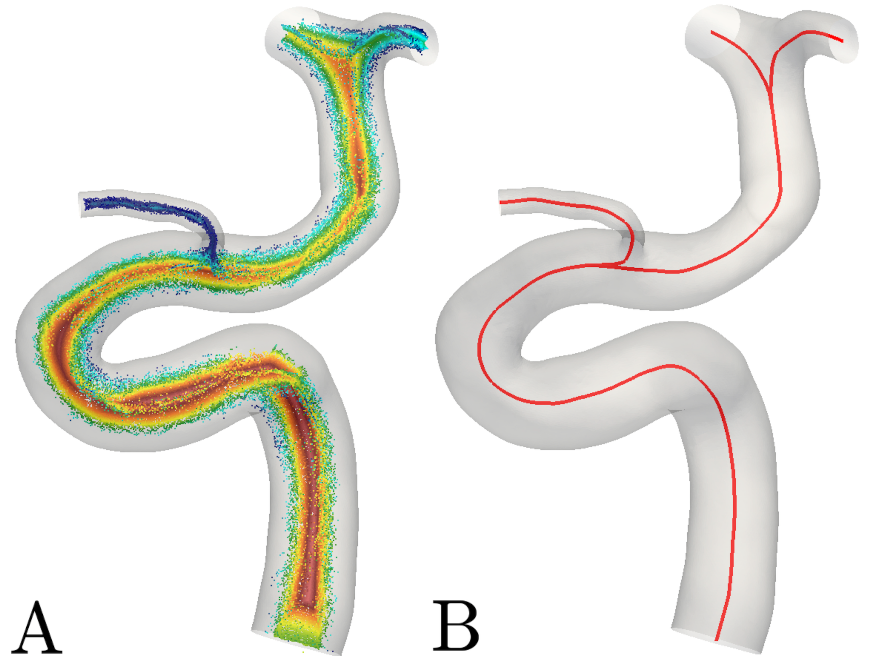

# Summary

Cardiovascular diseases are overwhelming the healthcare systems, and the
costs are anticipated to increase in the years to come [@Murray1997],
not to the mention the personal tragedy for those affected [@gage1996effect].
Systemic risk factors are well known to correlate with cardiovascular diseases in general,
but, for instance, arterial plaques and brain aneurysms are focalized, highlighting
the role of local hemodynamics. Furthermore, blood-flow induced wall shear stress (WSS) is
known to contribute to vessel wall adaption and remodeling [@Malek1999b, @morbiducci2016atherosclerosis],
but is challenging to measure *in-vivo*. On the other hand, medical images are routinely available and have
been extensively used in combination with computational fluid dynamics to
study the initiation, progression, and outcome of vascular pathologies [@taylor2010image].

We know that the morphological features of, for instance, the internal
carotid artery is statistically associated with the presence of aneurysms [@Schimansky01122013, @ingebrigtsen2004bifurcation].
Therefore, understanding how the local hemodynamics change with morphology is of great interest and
is typically investigated with parameterized idealized geometric models [@lauric2018proximal], however at the cost of
oversimplified results. To use realistic geometries we could instead correlate the shape and computed
stresses based on hundreds of patient-specific models, but this is very labor intensive and
error-prone [@valen2018real, @berg2018multiple].

Our goal was to take the best from both approaches and create a tool which could parameterize patient-specific
geometries to mimic the natural variability of morphological features in the population. We here present a framework,
*morphMan*, that allows for *objective*, *reproducible*, and *automatic* virtual manipulation of tubular structures
here exemplified with application to the cerebrovasculature.

\

**Figure 1:** 
   A visualization of the Voronoi diagram (left) and the centerline (right) of a surface.

In a surface, each cell is connected, and manipulating one will alter the surrounding geometry as well. Instead, we 
have based the algorithms on the centerlines and Voronoi diagram of the surface, see Figure 1. The point in the Voronoi 
diagram are not connected, and therefore easier to manipulate. As a result, only the region of interest is manipulated, and the rest of the geometry is left unchanged. Using the Voronoi diagram to alter the surface was first presented in 
[@Piccinelli2011]; moreover, a subset of the algorithms are presented in [@Bergersen2016] and [@kjeldsberg2018investigating].

In *morphMan v0.1* you can alter cross-sectional area, bifurcation angles, 
overall curvature in a segment, and the shape of specific bends. For each
category, there is a wide range of options, thus providing the users with many degrees of
freedom for manipulating the geometries. Shown in Figure 2 is an example of rotating the
branches in a bifurcation 'up' and 'down'. *morphMan* is easily expandable for specialized manipulations.

\

**Figure 2:** 
   Output from *morphMan* for manipulating the bifurcation angles.

*morphMan* is a general tool for manipulating tubular objects. In the context of flow in the cardiovascular system,
*morphMan* opens new lines of investigation for unraveling the coupling between
morphology and the computed local hemodynamics.

# Acknowledgements

We acknowledge Alban Souche for testing morphMan, and the two open-source projects [vtk](https://www.vtk.org/), and [vmtk](http://www.vmtk.org).

# References
